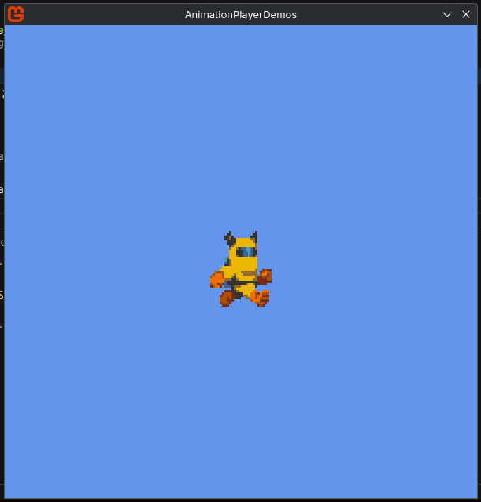
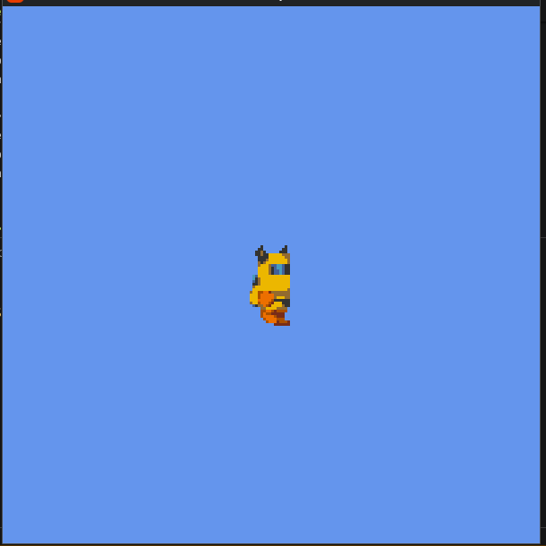
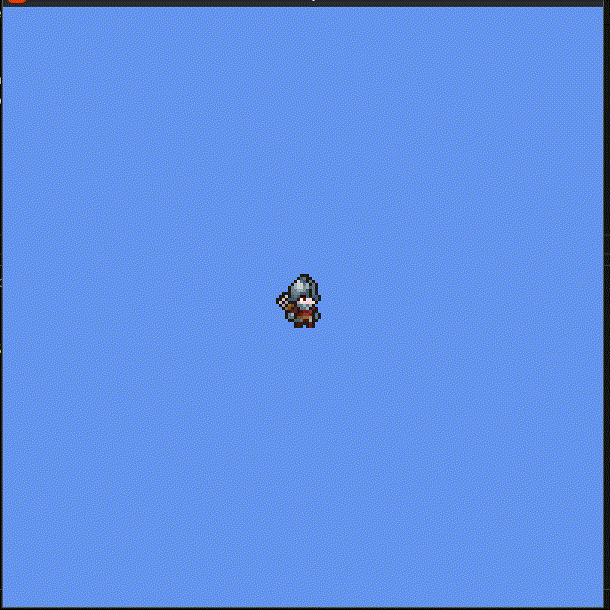
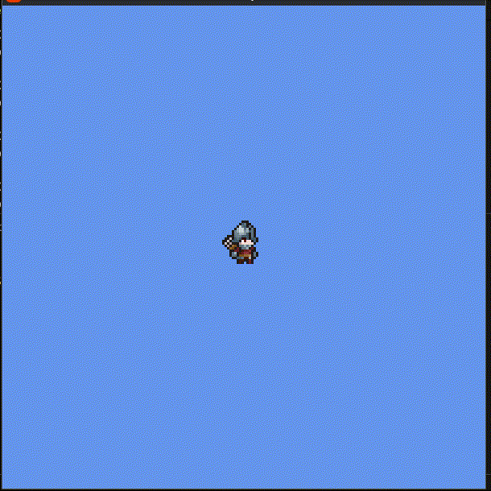
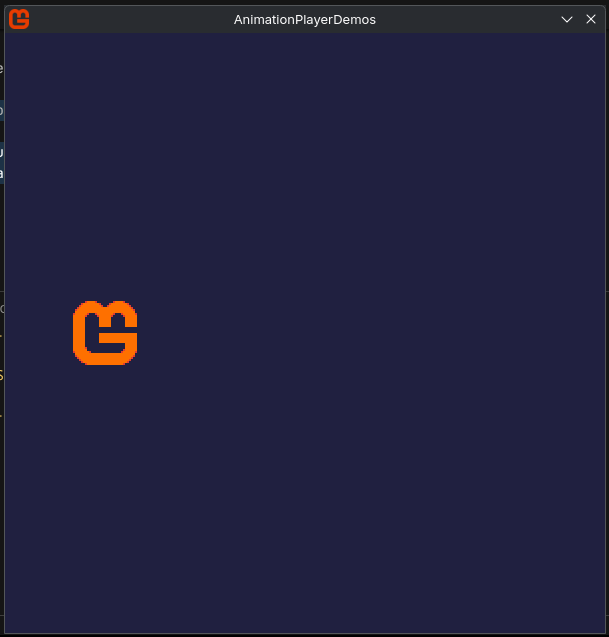
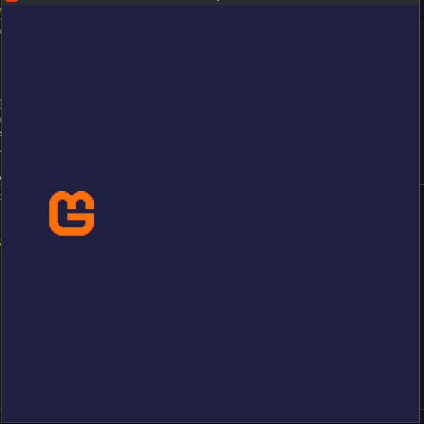
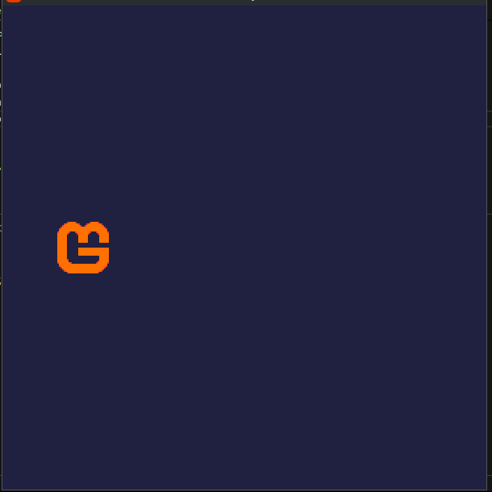
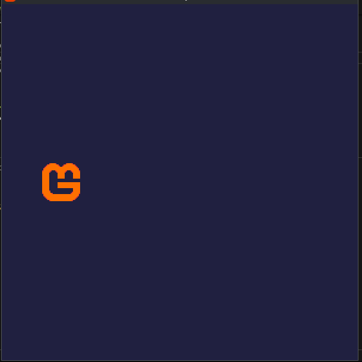
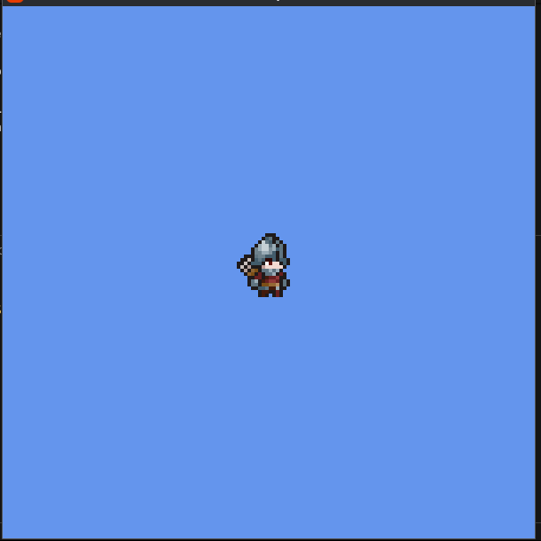

# 🎬 AnimationPlayer

## About this module

> ✨ This module is **engine-agnostic**, which means that it should work properly with [MonoGame](https://monogame.net/), [FNA](https://fna-xna.github.io/), [Unity](https://unity.com/pt) (as a plugin), or any other framework/engine!

🤖 This module was inspired by Godot's AnimationPlayer, which means that the way you use it should feel similar to Godot's AnimationPlayer.

🎯 The goal of this module is to make easy to animate almost anything by using keyframes that call functions
over time.

☕ The flow is simply this:

1. Create an AnimationPlayer
2. Create an Animation and add it to the AnimationPlayer
3. Add keyframes to the animation
4. Play the animation.

## ⭐ How to install?

Simply add the [package](https://www.nuget.org/packages/LyiarOwl.AnimationPlayer/) to your [MonoGame](https://monogame.net) project:
```bash
dotnet add package LyiarOwl.AnimationPlayer
```

[](https://badge.fury.io/nu/LyiarOwl.AnimationPlayer)

- [API Documentation](API.md)
- [Changelog](CHANGELOG.md)
---

## Keyframes

This module has 3 types of keyframes: **IntervalKeyframe**, **InterpolationKeyframe** and **PauseKeyframe**:

- **IntervalKeyframe**: Is a common keyframe that just execute and have a defined interval.
- **InterpolationKeyframe**: Interpolates a value from a point to another.
- **PauseKeyframe**: Pauses the animation until a condition becomes `true`.

---

## How to use

### Initializing

Before anything, make sure to call `AnimationPlayerCore.Update` once and globally:

```csharp
using LyiarOwl.AnimationPlayer;
...
public class Game1 : Game {
    ...
    protected override void Update(GameTime gameTime) {
        AnimationPlayerCore.Update(gameTime.ElapsedGameTime);
        // or
        float dt = (float)gameTime.ElapsedGameTime.TotalSeconds;
        AnimationPlayerCore.Update(dt);
        ...
    }
    ...
}
```

Now we can begin.

### Creating the AnimationPlayer
To create the AnimationPlayer is very simple actually:

```csharp
private AnimationPlayer _animationPlayer;

protected override void Initialize() {
    _animationPlayer = new AnimationPlayer();
}

protected override void Update(GameTime time) {
    /* make sure to call AnimationPlayerCore.Update 
    before everything! */

    _animationPlayer.Update();
}
```

The AnimationPlayer uses GameTime internally, which is provided by the AnimationPlayerCore class. In this way, you don't need to worry about passing a `gameTime` argument to the `Update` method of your AnimationPlayer.

### IntervalKeyframe

I think that the best way of showing you what this module can do is presenting examples:

#### Setup
Spritesheet used (created by [Ansimuz](https://ansimuz.itch.io/super-grotto-escape-pack)):

[](https://raw.githubusercontent.com/LyiarOwl/LyiarOwl.AnimationPlayer/main/imgs/player-run.png)

```csharp
using LyiarOwl.AnimationPlayer;

...
private Texture2D _spriteSheet;
private Rectangle _clipRect;
...

protected override void Initialize() {
    _graphics.PreferredBackBufferWidth = 640;
    _graphics.PreferredBackBufferHeight = 640;
    _graphics.ApplyGraphics();
    
    ...
}

protected override void LoadContent() {
    ...
    _spriteSheet = Content.Load<Texture2D>("player-run");
    _clipRect = new Rectangle(0, 0, 32, 38);
}

protected override void Draw(GameTime gameTime) {
    Vector2 position = new Vector2(300f);
    Vector2 origin = _clipRect.Size.ToVector2() * 0.5f;
    
    _spriteBatch.Begin(samplerState: SamplerState.PointClamp);

    _spriteBatch.Draw(
        _spriteSheet,
        position,
        _clipRect,
        Color.White,
        0f,
        origin,
        3f,
        SpriteEffects.None,
        0f
    );

    _spriteBatch.End();

    ...
}
```

[](https://raw.githubusercontent.com/LyiarOwl/LyiarOwl.AnimationPlayer/main/imgs/screenshot0.png)

#### Animating the sprite

```csharp
...
private AnimationPlayer _animPlayer;

...
protected override void Initialize() {
    ...
    _animPlayer = new AnimationPlayer();
    ...
}

protected override void LoadContent() {
    ...
    _animPlayer.Add(
        new Animation(
            name: "run",
            keyframes: [
                new IntervalKeyframe(
                    () => _clipRect.X = 0,
                    begin: TimeSpan.FromSeconds(0.0),
                    end: TimeSpan.FromSeconds(0.1)
                ),
                new IntervalKeyframe(
                    () => _clipRect.X = _clipRect.Width,
                    begin: TimeSpan.FromSeconds(0.1),
                    end: TimeSpan.FromSeconds(0.2)
                ),
                new IntervalKeyframe(
                    () => _clipRect.X = _clipRect.Width * 2,
                    begin: TimeSpan.FromSeconds(0.2),
                    end: TimeSpan.FromSeconds(0.3)
                ),
                new IntervalKeyframe(
                    () => _clipRect.X = _clipRect.Width * 3,
                    begin: TimeSpan.FromSeconds(0.3),
                    end: TimeSpan.FromSeconds(0.4)
                ),
                new IntervalKeyframe(
                    () => _clipRect.X = _clipRect.Width * 4,
                    begin: TimeSpan.FromSeconds(0.4),
                    end: TimeSpan.FromSeconds(0.5)
                ),
                new IntervalKeyframe(
                    () => _clipRect.X = _clipRect.Width * 5,
                    begin: TimeSpan.FromSeconds(0.5),
                    end: TimeSpan.FromSeconds(0.6)
                ),
            ],
            duration: TimeSpan.FromSeconds(0.6),
            loop: AnimationLoop.Loop
        )
    );

    _animPlayer.Play("run");
    ...
}

protected override void Update(GameTime gameTime) {
    AnimationPlayerCore.Update(gameTime.ElapsedGameTime);
    _animPlayer.Update();
    ...
}
```

[](https://raw.githubusercontent.com/LyiarOwl/LyiarOwl.AnimationPlayer/main/imgs/screengif0.gif)

- Creating the `AnimationPlayer` within `Initialize` or `LoadContent` doesn't matter because the animator doesn't depends on the `GraphicsDevice`.
- Is completely safe to call `Play` within the `Update` method.
    - The animation will not restart if it is already playing (unless you call `Reset` explicitly).

#### `AutoDistribute`

Note that the interval between all the keyframes follow an incremental pattern (0.0 .. 0.1, 0.1 .. 0.2, 0.2 .. 0.3 and so on). In this case you can use the method `AutoDistribute` to distribute the keyframes according with the duration of the animation:

```csharp
...
_animPlayer.Add(
    IntervalKeyframe.AutoDistribute(
        new Animation(
            name: "run",
            keyframes: [
                new IntervalKeyframe(
                    () => _clipRect.X = 0
                ),
                new IntervalKeyframe(
                    () => _clipRect.X = _clipRect.Width
                ),
                new IntervalKeyframe(
                    () => _clipRect.X = _clipRect.Width * 2
                ),
                new IntervalKeyframe(
                    () => _clipRect.X = _clipRect.Width * 3
                ),
                new IntervalKeyframe(
                    () => _clipRect.X = _clipRect.Width * 4
                ),
                new IntervalKeyframe(
                    () => _clipRect.X = _clipRect.Width * 5
                ),
            ],
            duration: TimeSpan.FromSeconds(0.6),
            loop: AnimationLoop.Loop
        )
    )
);
...
```

The result will be the exact same as before.
By the way, if you change the duration of the animation during its
creation, the method `AutoDistribute` will automatically adjust the `begin` and `end` of all the keyframes accordingly with that duration.

> ⚠️ **API change notice**:
> In versions **<= 0.1.1**, the method now called `AutoDistribute`
> was previously named `SortKeyframesByDuration`.
> 
> If you're following older examples, update the method name accordingly.

> 💡 If your animation has only one frame, **you still need to set its duration to a value greater than `0.0`**; otherwise, the animation will never play.
>
> You must also set the keyframe’s `Begin` and `End` to cover the full animation duration (or simply use `AutoDistribute`).


#### Playing the animation backwards

The play methods accepts a second parameter called `backwards`, if `true`, the animator will start to play the animation from the end to the beginning.

#### There is no RESET animation

Despite of this module being very inspired by Godot's AnimationPlayer, there is no RESET animation like exists in there.

That is, the last keyframe will always be the last state of everything that changed when the `onUpdate` callback of that keyframe was called:

Spritesheet used (created by [Zerie](https://zerie.itch.io/tiny-rpg-character-asset-pack)):

[](https://raw.githubusercontent.com/LyiarOwl/LyiarOwl.AnimationPlayer/main/imgs/Soldier-Attack01.png)

```csharp
new Animation(
    name: "attack",
    keyframes: [
        new IntervalKeyframe(
            () => _clipRect.X = 0
        ),
        new IntervalKeyframe(
            () => _clipRect.X = _clipRect.Width
        ),
        new IntervalKeyframe(
            () => _clipRect.X = _clipRect.Width * 2
        ),
        new IntervalKeyframe(
            () => _clipRect.X = _clipRect.Width * 3
        ),
        new IntervalKeyframe(
            () => _clipRect.X = _clipRect.Width * 4
        ),
        new IntervalKeyframe(
            () => _clipRect.X = _clipRect.Width * 5
        ),
    ],
    duration: TimeSpan.FromSeconds(0.6),
    loop: AnimationLoop.NoLoop // <= not looping (default)
)
```

> `AnimationLoop.NoLoop` is the default option, therefore you can omit the line `loop: AnimationLoop.NoLoop`.

[](https://raw.githubusercontent.com/LyiarOwl/LyiarOwl.AnimationPlayer/main/imgs/screengif1.gif)

Note that the changes of the last keyframe remains even after the animation end.

This is actually an expected behavior, since the animation call ordinary functions like any other, but in specific moments (controlled by time).

In this case, you might want to reset something after the last keyframe ends:

```csharp
new Animation(
    name: "attack",
    keyframes: [
        ...
        new IntervalKeyframe(
            onEnter: null,
            onUpdate: () => _clipRect.X = _clipRect.Width * 5,
            onExit: () => _clipRect.X = 0;
        ),
    ],
    ...
)
```

[](https://raw.githubusercontent.com/LyiarOwl/LyiarOwl.AnimationPlayer/main/imgs/screengif2.gif)

#### Run Once

The `onUpdate` callback run just once and at the exact moment as the `onEnter` (or when the keyframe begins). If by some reason you need that the update callback be called continuously while the keyframe is active, set the argument `runOnce` to `false`:
- `onEnter`: runs only once at the beginning of the keyframe.
- `onUpdate`: (default) runs only once at the beginning of the keyframe, but if `runOnce` is set to `false`, it will run continuously until the keyframe ends.
- `onExit`: runs only once at the end of the keyframe.

### InterpolationKeyframe

#### Setup
Sprite used (created by [me](https://www.deviantart.com/lyiarowl/art/MonoGame-Splash-Pixel-Art-1280781127))

[](https://raw.githubusercontent.com/LyiarOwl/LyiarOwl.AnimationPlayer/main/imgs/monogame-icon.png)

> I created this pixelated version of the MonoGame's logo, not the logo itself! 😅

```csharp
using LyiarOwl.AnimationPlayer;

...
private Vector2 _position = new Vector2(100f, 300f);
private Texture2D _texture;
private AnimationPlayer _animPlayer;
...

public Game1() {
    ...

    IsFixedTimeStep = true;
    TargetElapsedTime = TimeSpan.FromSeconds(1.0 / 60.0);
}

...

protected override void LoadContent() {
    ...

    _texture = Content.Load<Texture2D>("monogame-icon");
    _animPlayer = new AnimationPlayer();
}

protected override void Update(GameTime gameTime) {
    AnimationPlayerCore.Update(gameTime.ElapsedGameTime);
    _animPlayer.Update();
}

protected override void Draw(GameTime gameTime) {
    GraphicsDevice.Clear(new Color(32, 32, 64));

    Vector2 origin = _texture.Bounds.Size.ToVector2() * 0.5f;
    _spriteBatch.Begin(samplerState: SamplerState.PointClamp);

    _spriteBatch.Draw(
        _texture,
        _position,
        null,
        Color.White,
        0f,
        origin,
        2f,
        SpriteEffects.None,
        0f
    );

    _spriteBatch.End();
    
    ...
}
```

[](https://raw.githubusercontent.com/LyiarOwl/LyiarOwl.AnimationPlayer/main/imgs/screenshot1.png)

#### Moving the sprite

```csharp
new Animation(
    name: "move",
    keyframes: [
         new InterpolationKeyframe(
            value => _position.X = value,
            from: _position.X,
            to: 500f,
            begin: TimeSpan.FromSeconds(0.0),
            end: TimeSpan.FromSeconds(2.0),
            type: InterpolationType.Linear // default (this line can be ommited)
        )
    ],
    duration: TimeSpan.FromSeconds(2.0),
)
```

This keyframe will take the value in `from` (`100`) and will interpolate it until it get to `to` (`500`). The result of this interpolation over time is return through the argument `value`:

By the way, in cases like this where you have just one single keyframe and it begins at 0.0 and end at the exact end of the animation, you can use
`AutoDistribute` here too:

```csharp
IntervalKeyframe.AutoDistribute(
    new Animation(
        name: "move",
        keyframes: [
            new InterpolationKeyframe(
                value => _position.X = value,
                from: _position.X,
                to: 500f,
            )
        ],
        duration: TimeSpan.FromSeconds(2.0),
    )
)
```

[](https://raw.githubusercontent.com/LyiarOwl/LyiarOwl.AnimationPlayer/main/imgs/screengif3.gif)

#### Types of Interpolation

This keyframe accepts 4 types of interpolation:

1. **`InterpolationType.Linear`** (default): you already see it above.
2. **`InterpolationType.EaseIn`**:

[](https://raw.githubusercontent.com/LyiarOwl/LyiarOwl.AnimationPlayer/main/imgs/screengif4.gif)

4. **`InterpolationType.EaseOut`**:

[](https://raw.githubusercontent.com/LyiarOwl/LyiarOwl.AnimationPlayer/main/imgs/screengif5.gif)

5. **`InterpolationType.EaseInOut`**:

[](https://raw.githubusercontent.com/LyiarOwl/LyiarOwl.AnimationPlayer/main/imgs/screengif6.gif)

### Types of loop

1. `AnimationLoop.NoLoop` (default): you already see it before.
2. `AnimationLoop.Loop`: you already see it before.
3. `AnimationLoop.PingPong`:

[](https://raw.githubusercontent.com/LyiarOwl/LyiarOwl.AnimationPlayer/main/imgs/screengif7.gif)

### PauseKeyframe

#### Setup:
```csharp
using LyiarOwl.AnimationPlayer;
...

private Texture2D _spriteSheet;
private Rectangle _clipRect;
private AnimationPlayer _animPlayer;
private bool _startToAttack;
private bool _attack;

...
protected override void LoadContent() {
    ...
    _spriteSheet = Content.Load<Texture2D>("Soldier-Attack01");
    _clipRect = new Rectangle(0, 0, 100, 100);

    _animPlayer.Add(
        new Animation(
            name: "attack",
            keyframes: [
                new IntervalKeyframe(...),
                new IntervalKeyframe(...),
                new IntervalKeyframe(
                    () => _clipRect.X = _clipRect.Width * 2,
                    begin: TimeSpan.FromSeconds(0.2),
                    end: TimeSpan.FromSeconds(0.3)
                ),
                
                new PauseKeyframe(
                    onUpdate: null,
                    condition: () => _attack,
                    begin: TimeSpan.FromSeconds(0.25),
                    end: TimeSpan.FromSeconds(0.3)
                ),

                new IntervalKeyframe(
                    () => _clipRect.X = _clipRect.Width * 3,
                    begin: TimeSpan.FromSeconds(0.3),
                    end: TimeSpan.FromSeconds(0.4)
                ),

                new IntervalKeyframe(...),
                new IntervalKeyframe(...),
            ],
            duration: TimeSpan.FromSeconds(0.6),
        )
    );
    ...
}

protected override void Update(GameTime gameTime) {
    AnimationPlayerCore.Update(gameTime);
    _animPlayer.Update();

    var kbstate = Keyboard.GetState();
    if (kbstate.IsKeyDown(Keys.Space) && !_startToAttack)
    {
        _startToAttack = true;
        _animPlayer.Play("attack");
    }

    if (kbstate.IsKeyDown(Keys.F) && !_attack)
    {
        _attack = true;
    }

    ...
}
```

Note that the `begin` of the `PauseKeyframe` was set to start at `0.25`, that is, between the end of the previous keyframe and the begin of the next, this was intentional, you can for sure set the begin of this keyframe to exactly `0.2`.

Also the order of the keyframes doesn't really matter, you can move the `PauseKeyframe` to the end of the array and it will still play after the second keyframe.

The idea above is:
- When pressing the Spacebar the animation will begin, but it will stop when the `PauseKeyframe` be reached.
- When you press F the `_attack` attribute becomes `true`, therefore, the condition is satisfied, therefore, the animation can continue.

[](https://raw.githubusercontent.com/LyiarOwl/LyiarOwl.AnimationPlayer/main/imgs/screengif8.gif)

> Honestly, during my tests I didn't find any useful moment to use this kind of Keyframe yet, but might you have one, so... I hope you enjoy it.

## 🥳 Finally
I really hope this module is useful to you, if you have any problems using it you can open an issue in this repository or even contact me via:

- [@Lyiar_u (on X)](https://x.com/lyiar_u)
- "LyiarOwl.cs" (My personal Discord)
- [MonoGame Discord Server (@ me in there)](https://discord.gg/monogame)
